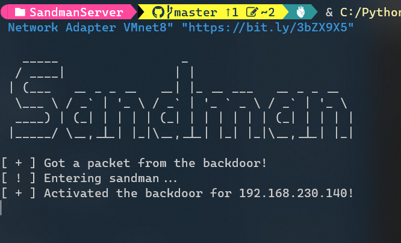

# Sandman

  

Sandman is a backdoor that is meant to work on hardened networks during red team engagements.

Sandman works as a stager and leverages NTP (a protocol to sync time & date) to get and run an arbitrary **shellcode** from a pre-defined server.

Since NTP is a protocol that is overlooked by many defenders resulting in wide network accessibility.

## Usage



### SandmanServer (Usage)

Run on windows / *nix machine:

```sh
python3 sandman_server.py "Network Adapter" "Payload Url" "optional: ip to spoof"
```

- Network Adapter: The adapter that you want the server to listen on (for example Ethernet for Windows, eth0 for *nix).

- Payload Url: The URL to your shellcode, it could be your agent (for example, CobaltStrike or meterpreter) or another stager.

- IP to Spoof: If you want to spoof a legitimate IP address (for example, time.microsoft.com's IP address).

### SandmanBackdoor (Usage)

To start, you can compile the SandmanBackdoor as [mentioned below](#setup), because it is a single lightweight C# executable you can execute it via ExecuteAssembly, run it as an NTP provider or just execute/inject it.

### SandmanBackdoorTimeProvider (Usage)

To use it, you will need to follow simple steps:

- Add the following registry value:

```bat
reg add "HKEY_LOCAL_MACHINE\SYSTEM\CurrentControlSet\Services\W32Time\TimeProviders\NtpClient" /v DllName /t REG_SZ /d "C:\Path\To\TheDll.dll"
```

- Restart the w32time service:

```bat
sc stop w32time
sc start w32time
```

**NOTE: Make sure you are compiling with the x64 option and not any CPU option!**

## Capabilities

- Getting and executing an arbitrary payload from an attacker's controlled server.

- Can work on hardened networks since NTP is usually allowed in FW.

- Impersonating a legitimate NTP server via IP spoofing.

## Setup

### SandmanServer (Setup)

- Python 3.9

- The requirements are specified in the [requirements](/SandmanServer/requirements.txt) file.

### SandmanBackdoor (Setup)

To compile the backdoor I used Visual Studio 2022, but as mentioned in the [usage section](#usage) it can be compiled with both VS2022 and CSC.
You can compile it either using the USE_SHELLCODE and use Orca's shellcode or without USE_SHELLCODE to use WebClient.

### SandmanBackdoorTimeProvider (Setup)

To compile the backdoor I used Visual Studio 2022, you will also need to install [DllExport](https://github.com/3F/DllExport) (via Nuget or any other way) to compile it.
You can compile it either using the USE_SHELLCODE and use Orca's shellcode or without USE_SHELLCODE to use WebClient.

## IOCs

- A shellcode is injected into RuntimeBroker.

- Suspicious NTP communication starts with a known magic header.

- YARA rule.

## Contributes

- [Orca](https://github.com/ORCx41/) for the shellcode.

- Special thanks to [Tim McGuffin](https://twitter.com/NotMedic) for the [time provider idea](https://twitter.com/NotMedic/status/1561354598744473601).

Thanks to those who already contributed and I'll happily accept contributions, make a pull request and I will review it!
